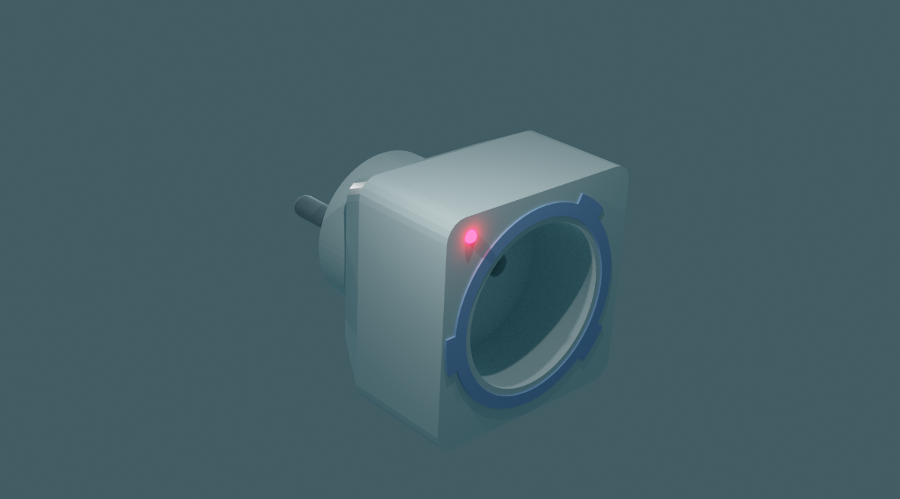
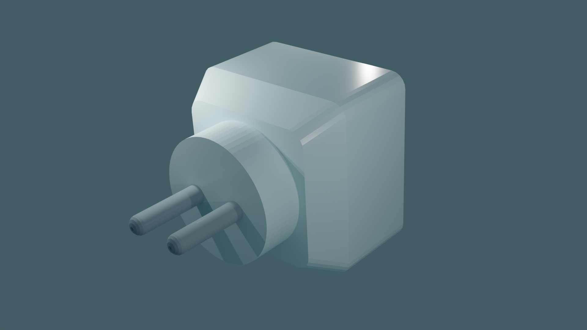
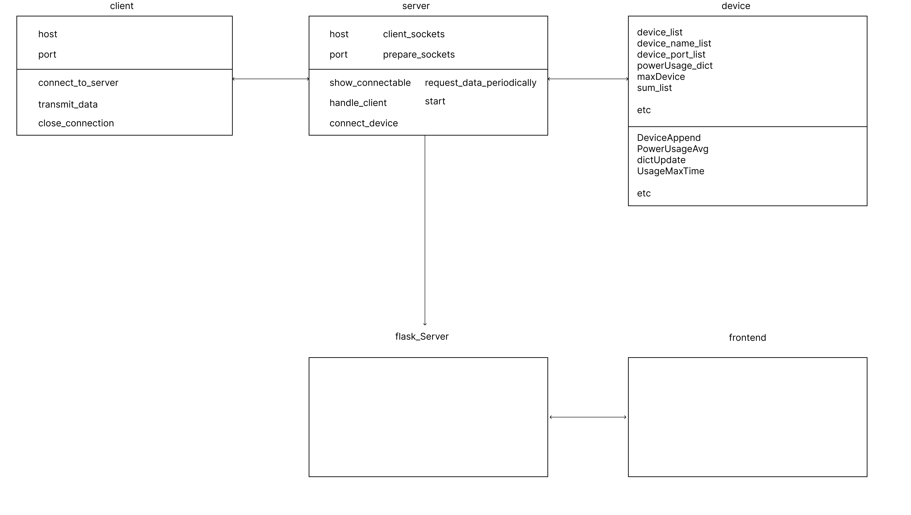

# 소형화 및 개인화 된 전력 모니터링 시스템

## 프로젝트 개요
이 프로젝트는 가정이나 학교, 사무실등 개인 혹은 소규모 집단 시설에서 사용되는 전력을 세부적으로 분석할 수 있도록 모니터링이 가능한 시스템을 개발하는 것을 목표로 하였다. 기존의 서비스는 가정이나 소집단의 공간에서 사용되는 전체 전력량만을 모니터링 할 뿐 어느 콘센트에서 얼마만큼의 전력을 사용하는지는 보여주지 않는다는 단점이 있었다. 이를 <b>콘센트에 꽃아 전력을 측정하고 서버로 보내주는 가상의 하드웨어</b>를 이용하여 전력을 측정, 이를 서버로 보내에서 모니터링 할 수 있다.

## 하드웨어 설계
가상의 하드웨어는 콘센트에 꽂아 사용 할 수 있으며 이 하드웨어에다 실제 사용할 콘센트를 꽂아 가전제품을 사용하면 해당 콘센트로 부터 사용되는 전력을 하드웨어의 디지털 멀티미터를 통해 측정, 인터넷을 통해 로컬 서버로 전송하게 된다. 

## 소프트웨어 구조
해당 소프트웨어는 가상의 하드웨어의 동작을 수행하는 client 클래스와 해당 client들로부터 데이터를 읽어들여 처리하는 server 클래스, 벡엔드 서버, 프론트 엔드로 구성되어 있다.

## 실행
해당 소프트웨어는 가상의 하드웨어에서 서버로 데이터를 주기 위해 소켓 연결을 시도한다. client.py는 client클래스 인스턴스 10개를 생성하고 각각 소켓 연결을 위한 쓰레드를 생성한다. 실행 순서는 다음과 같다.

1. 플라스크 서버를 연다.
   - 아마 플라스크 서버가 실행되더라도 아래 2,3번 단계를 실행했을때 에러가 뜬다면 이는 포트 번호 설정이 잘 못 되었기 때문이다. 그렇기에 항상 플라스크 서버 실행 전에 아래의 단계를 거쳐야 한다.
   - client.py의 포트 번호를 바꾸고 저장한다.
   - flask_server.py를 실행한다.
   - flask_server.py를 실행한 상태에서 flask_server.py의 포트번호를 바꾸고 ctrl-s를 누른다. 
   - 위 단계를 수행하면 정상적으로 소켓 포트가 열릴 것이다.
2. react앱을 실행한다.
3. 화면에 아무런 데이터가 안들어오는데 이는 아직 하드웨어 연결이 안되었기 때문이다. client.py를 실행하면 10개의 하드웨어가 서버에 연결된다.

## 초기 환경 세팅 법
1. git clone "레포지토리 주소"
2. cd 폴더 명
3. npm install
4. 위에서 언급한 절차에 따라 flask_server.py 실행
5. npm run dev 실행

## 프로그램 화면
